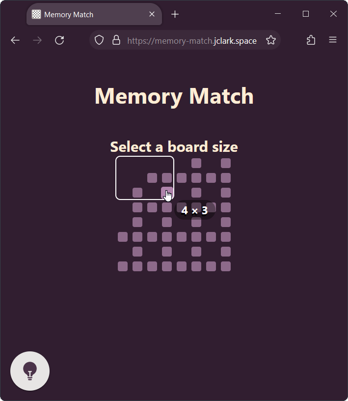
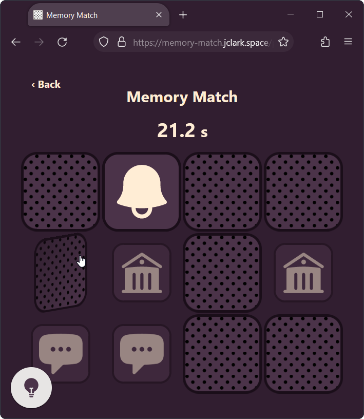

# Memory Match
Memory match is a classic card matching game. Choose a board size and start matching cards.

### The board
The board can be made of any even number of cards from 2&times;3 up to 8&times;8.

### The cards
Click a card to flip it over. Check if two cards match by flipping both over. The object of the game is to find all pairs of matching cards and flip them over.

### High scores
High scores are saved locally. You can clear them by clearing the local storage for the page.

 | 
-|-

Icons are from [Heroicons](https://heroicons.com/).